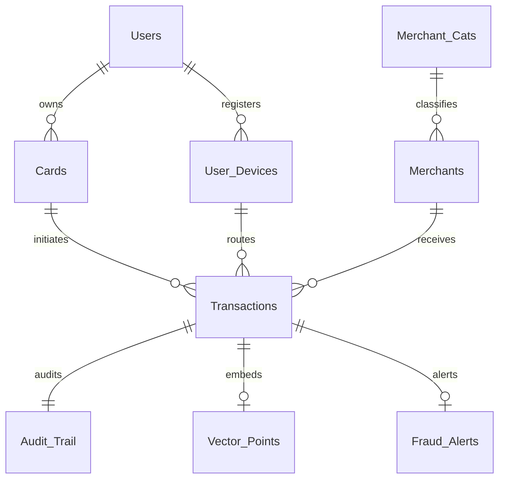

# 🛡️ RT-AFDE: Real-Time Anomaly & Fraud Detection Engine

[](https://www.postgresql.org/)
[](https://www.python.org/)
[](https://streamlit.io/)
[](https://github.com/k-a-r-s-a-n/Real-Time-Anomaly-Fraud-Detection-Engine)

> **Enterprise DBMS Architecture for Financial Transaction Anomaly & Fraud Mitigation.**  
> Developed as part of **DBMS Coursework (DA2)**. Demonstrates Boyce-Codd Normal Form (BCNF), automated PL/pgSQL triggers and stored procedures, referential integrity enforcement, and a Neobrutalist Streamlit management dashboard.

---

## 📑 Table of Contents

- [Overview](#-overview)
- [System Architecture](#-system-architecture)
- [Database Schema (9 BCNF Tables)](#-database-schema-9-bcnf-tables)
- [PL/pgSQL Automation](#-plpgsql-automation)
  - [Triggers](#1-triggers)
  - [Stored Procedures](#2-stored-procedures)
  - [Functions](#3-functions)
- [Management Dashboard](#-management-dashboard)
- [10 Domain-Specific Queries (DA2 Report)](#-10-domain-specific-queries-da2-report)
- [Installation & Quickstart](#-installation--quickstart)
- [Project Structure](#-project-structure)
- [Evaluation & Demo Guide](#-evaluation--demo-guide)

---

## 🧭 Overview

**RT-AFDE** is a database management system designed to process, inspect, and evaluate credit/debit card transactions in real time. It shifts critical validation and business rules away from the application layer down into the database engine:

* **Engine-Enforced Constraints:** Business rules (e.g., non-positive charges) are rejected by `BEFORE INSERT` triggers before hitting disk storage.
* **1:1 Tamper-Proof Audit Logging:** An immutable `AFTER INSERT` trigger automatically records every transaction into an `Audit_Trail` table with 100% parity.
* **Stored Procedure Risk Scoring:** Analyzes 30-day velocity (card testing bursts) and financial spikes (> $20,000) inside PostgreSQL via `CALL update_user_risk_profile()`.
* **Referential Integrity:** Enforces foreign keys across 9 tables, preventing data orphaning.

---

## 🏛️ System Architecture

```
┌────────────────────────────────────────────────────────────────────────┐
│                      STREAMLIT MANAGEMENT DASHBOARD                    │
│             (Interactive Neobrutalist UI at localhost:8501)            │
└───────────────────────────────────┬────────────────────────────────────┘
                                    │
                                    │ psycopg2 (connection pooling)
                                    ▼
┌────────────────────────────────────────────────────────────────────────┐
│                        POSTGRESQL 16 DATABASE                          │
│                     (database: fraud_detection)                        │
├────────────────────────────────────────────────────────────────────────┤
│  9 BCNF Tables:                                                        │
│  Users ── Cards ── Transactions ── Audit_Trail ── User_Devices         │
│  Merchants ── Merchant_Cats ── Vector_Points (DA3) ── Fraud_Alerts     │
├────────────────────────────────────────────────────────────────────────┤
│  PL/pgSQL Engine Layer:                                                │
│  • trg_validate_txn (BEFORE INSERT) -> Blocks invalid amounts <= 0    │
│  • trg_audit_txn (AFTER INSERT)    -> Auto-writes to Audit_Trail       │
│  • update_user_risk_profile()      -> Stored procedure risk scoring    │
│  • resolve_device_and_flag()       -> Dynamic device resolution        │
└────────────────────────────────────────────────────────────────────────┘
```

---

## 🗄️ Database Schema (9 BCNF Tables)

All relations are normalized to **Boyce-Codd Normal Form (BCNF)** to eliminate update, insertion, and deletion anomalies.



| Table | Description | Primary Key | Foreign Keys |
|---|---|---|---|
| `Users` | Registered user identities and calculated risk ratings (`LOW`, `MEDIUM`, `HIGH`). | `user_id` | — |
| `User_Devices` | Device/IP fingerprints linked uniquely to users. | `device_id` | `user_id` -> `Users` |
| `Cards` | Tokenized SHA-256 hashed payment cards. | `card_id` | `user_id` -> `Users` |
| `Merchant_Cats` | Standardized MCC categories with inherent risk levels. | `mcc_code` | — |
| `Merchants` | Registered vendor outlets. | `merchant_id` | `mcc_code` -> `Merchant_Cats` |
| `Transactions` | Real-time financial stream with lat/long coordinates. | `transaction_id` | `card_id`, `merchant_id`, `device_id` |
| `Audit_Trail` | Immutable log created by the database trigger on each insert. | `audit_id` | `transaction_id` -> `Transactions` |
| `Vector_Points` | Bridge relation for similarity search in vector databases (DA3). | `qdrant_point_id` | `transaction_id`, `merchant_id` |
| `Fraud_Alerts` | Downstream machine learning anomaly detection alerts (DA3). | `alert_id` | `transaction_id` -> `Transactions` |

---

## ⚙️ PL/pgSQL Automation

### 1. Triggers

* **`trg_validate_txn` (BEFORE INSERT on `Transactions`)**  
  Invokes `validate_transaction()`. Checks if `NEW.amount <= 0`. If true, raises an exception and cancels the insert before writing to disk.
* **`trg_audit_txn` (AFTER INSERT on `Transactions`)**  
  Invokes `log_transaction_audit()`. Automatically inserts a row into `Audit_Trail` containing `NEW.transaction_id`, action `'INSERT'`, and `now()`.

### 2. Stored Procedures

* **`update_user_risk_profile(p_user_id INT)`**  
  Aggregates the user's transactions over the last 30 days:
  * **`HIGH` Risk:** Txn count > 50 (card testing burst) **OR** max single amount > $20,000 (spike anomaly).
  * **`MEDIUM` Risk:** Txn count > 20 **OR** average amount > $5,000.
  * **`LOW` Risk:** All other activity patterns.

### 3. Functions

* **`resolve_device_and_flag(p_user_id INT, p_ip_address VARCHAR)`**  
  Dynamic lookup-or-insert: checks if `(user_id, ip_address)` exists in `User_Devices`. If known, returns `(device_id, FALSE)`. If new, registers the device and returns `(device_id, TRUE)`.

---

## 🖥️ Management Dashboard

Built with **Streamlit** using a custom **Neobrutalist design system** (3.5px black borders, hard drop shadows, Canary Yellow `#FFE156`, and Space Grotesk typography):

* **📊 View Data (READ):** Live inspector for all 9 tables, displaying latest rows and schema metadata with sortable grids.
* **➕ Add Record (INSERT):** Form with dynamic dropdowns (Cards, Merchants, Devices queried directly from PostgreSQL). Features one-click demo presets:
  * *Preset A ($150.00):* Demonstrates successful insert & automatic audit log creation.
  * *Preset B (-$500.00):* Demonstrates `trg_validate_txn` raising an exception.
* **🔄 Modify Record (UPDATE):**
  * *Manual Update:* Updates user email with row count validation.
  * *Stored Procedure:* Runs `CALL update_user_risk_profile()` with live Before vs. After metrics.
* **🗑️ Remove Record (DELETE):**
  * Demonstrates referential integrity: blocks deletion of users with attached cards/transactions.
  * *Demo Helper:* **"✨ Create Clean Deletable Test User"** creates an isolated user to demonstrate successful deletion (Case B) without manual SQL scripts.
* **ℹ️ About System:** Project architecture, table summary, and evaluation guide.

---

## 📊 10 Domain-Specific Queries (DA2 Report)

Found in [`sql/da2_10_queries.sql`](sql/da2_10_queries.sql):

1. **PL/SQL Function Call:** Dynamic device resolution with `resolve_device_and_flag()`.
2. **PL/SQL Procedure Call:** Risk recalculation with `CALL update_user_risk_profile()`.
3. **Multi-Table JOIN & Aggregation:** Top 5 highest risk merchants by volume (3-table JOIN).
4. **Subquery with HAVING:** Detection of users with multiple registered devices.
5. **Window Function (`DENSE_RANK`):** Transaction ranking per card partitioned by amount.
6. **Audit Trail Integrity Check:** 1:1 parity proof between `Transactions` and `Audit_Trail`.
7. **Common Table Expression (CTE):** High-frequency card testing pattern detection.
8. **UPDATE with Correlated Subquery:** Batch elevation of user risk tier for high-risk category activity.
9. **DELETE with Safe Anti-Join:** Removal of unused, expired cards.
10. **INSERT with RETURNING Clause:** Real-time trigger verification and auto-assigned ID return.

---

## 🚀 Installation & Quickstart

### Prerequisites
* [PostgreSQL 16+](https://www.postgresql.org/download/)
* [Python 3.11+](https://www.python.org/downloads/)

### 1. Database Setup
In pgAdmin or `psql`, create the database and run the schema and PL/pgSQL scripts:
```sql
CREATE DATABASE fraud_detection;
\c fraud_detection

\i sql/schema.sql
\i sql/functions.sql
\i sql/procedures.sql
```

### 2. Python Environment & Dependencies
```bash
# Clone the repository
git clone https://github.com/k-a-r-s-a-n/Real-Time-Anomaly-Fraud-Detection-Engine.git
cd Real-Time-Anomaly-Fraud-Detection-Engine

# Create and activate virtual environment
python -m venv venv
# On Windows:
venv\Scripts\activate
# On Linux/macOS:
source venv/bin/activate

# Install required packages
pip install -r requirements.txt
```

### 3. Generate Mock Data (2,000+ Transactions)
```bash
python python/generate_mock_data.py
```
*(Populates 50 users, realistic MCC categories, merchants, and 2,000 synthetic transactions with injected burst and spike fraud patterns).*

### 4. Launch the Management Dashboard
```bash
streamlit run dashboard/app.py
```
Open **`http://localhost:8501`** in your browser.

---

## 📁 Project Structure

```
rt-afde-dbms/
├── .streamlit/
│   └── config.toml             # Streamlit light mode & contrast configuration
├── dashboard/
│   └── app.py                  # Streamlit Neobrutalist GUI application
├── python/
│   ├── generate_mock_data.py   # Synthetic data generator (Faker + NumPy)
│   └── test_connection.py      # PostgreSQL connectivity tester
├── sql/
│   ├── schema.sql              # Complete 9-table BCNF schema DDL
│   ├── functions.sql           # PL/pgSQL functions and trigger definitions
│   ├── procedures.sql          # Stored procedure: update_user_risk_profile
│   ├── integrity_checks.sql    # Data validation & test suite
│   └── da2_10_queries.sql      # 10 domain queries for the DA2 report
├── requirements.txt            # Python dependencies
├── .gitignore                  # Git exclusions
├── LICENSE                     # MIT License
└── README.md                   # Project documentation
```

---

## 🎓 Evaluation & Demo Guide

Follow this 5-minute review script during project evaluations:

1. **Architecture (30s):** Explain the 9 BCNF-normalized tables and why logic lives in PostgreSQL.
2. **Data Inspection (45s):** Open **View Data (READ)** → show `transactions` (2,000 rows) and `audit_trail` (exact 1:1 match).
3. **Trigger Validation (45s):** Open **Add Record (INSERT)** → click **Preset B (-$500.00)** → show the `trg_validate_txn` red rejection error.
4. **Trigger Success (30s):** Click **Preset A ($150.00)** → submit → show the transaction ID and auto-created audit log.
5. **Stored Procedure (45s):** Open **Modify Record (UPDATE)** → select User #1 → run `CALL update_user_risk_profile()` → watch score update to `HIGH`.
6. **Foreign Key Protection (30s):** Open **Remove Record (DELETE)** → try deleting User #1 → show the foreign key protection block. Click **"✨ Create Clean Deletable Test User"** → delete that test user to demonstrate normal deletes.
7. **SQL Queries:** Present outputs from `sql/da2_10_queries.sql`.
